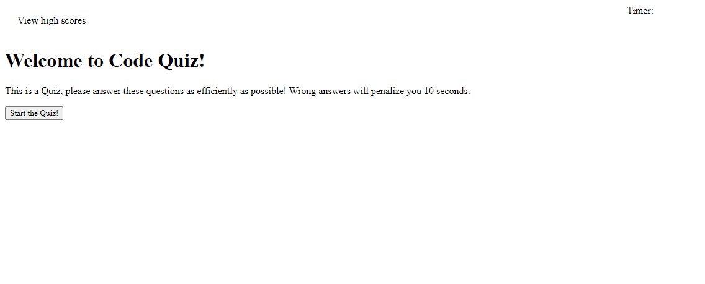

# code-quiz

## Description
This website is a quiz on some fundamental JavaScript questions. It is designed to see if you have a cursory understand of basic JavaScript knowledge. As you select your answer, you are moved on to the next question. Also, when you start the quiz a 120 second timer begins counting down.

## Screenshot

## Link to deployed website

[deployed] (https://vasilyg10.github.io/code-quiz/)

## Link to Github Repo

[github] (https://github.com/Vasilyg10/code-quiz)

### Created by: Vasily Giannakopoulos